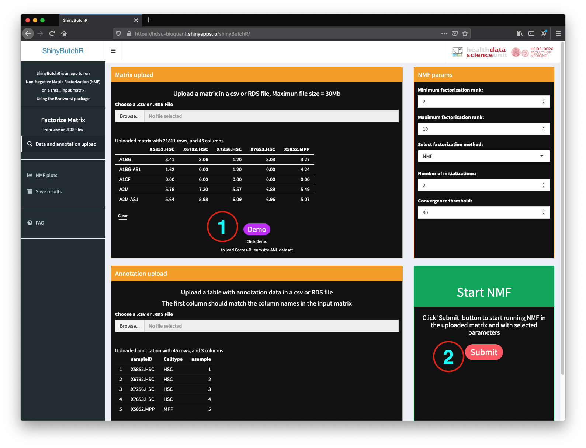

  
```{r load_style, warning=FALSE, message=FALSE, results="hide"}
library(BiocStyle)
library(ButchR)
library(knitr)
library(ComplexHeatmap)
library(viridis)
library(tidyverse)
```

# ShinyButchR 


`ShinyButchR` is an interactive R/Shiny app to perform NMF on an input matrix,
`ShinyButchR` uses `ButchR` to run the matrix decomposition and generate 
diagnostic plots and visualizations that helps to find association of the NMF 
signatures to known biological factors.


# How to use ShinyButchR 

The app can be used directly from the official 
[ShinyButchR website](https://hdsu-bioquant.shinyapps.io/shinyButchR/),
a pre-build image can be pulled from Docker 
[hdsu/shinybutchr](https://hub.docker.com/r/hdsu/shinybutchr):

`docker run --rm  -p 3838:3838 hdsu/shinybutchr`  

or also the Github repository can be pulled from 
[hdsu-bioquant/ShinyButchR](https://github.com/hdsu-bioquant/ShinyButchR).

## Loading screen

When you start the app the first displayed screen is a loading screen, while the
app loades ButchR and TensorFlow (**Figure 1**).  
Depending on the system this step could take from a few second to around one 
minute. If you are using `ShinyButchR` from the 
[ShinyButchR website](https://hdsu-bioquant.shinyapps.io/shinyButchR/), and the 
app was idle for more than one hour, a new instance has to be created by 
shinyapps.io, this process can take around one to one and a half minutes.  


  
  
## Data and annotation screen  

When the app is loaded, you are prompted to either run an analysis using the 
demo dataset, or to upload your own data (**Figure 2**). For this tutorial we are using the
demo dataset which is a the publicly available RNA-seq dataset of sorted blood 
cell populations, comprising 12 cell populations and 45 sam-ples 
(Corces et al., 2016).  

  
  

The options available in the **Data and annotation** screen are (**Figure 3**):
- **a** Upload a non-negative matrix in a csv or RDS file format using the file 
browser. You can also clear previously loaded datasets by clicking in the 
`clear` button.
2. Upload a table with annotation data in a csv or RDS file, the first column 
should match the column names in the input matrix. This file is optional and 
you can run the NMF based analysis without the annotation file.
3. NMF parameters: select the minimum and maximum factorization rank (minimum 
value allowed is 2 and maximum value allowed is 30); Select a factorization 
method, from "NMF" and "GRNMF_SC"; Number of initializations, number of times 
that the decomposition should be run with random initializations in ShinyButchR 
the limit in 10; Convergence threshold: in ShinyButchR the convergence of the
NMF is reach when every sample (in the columns of the input matrix), is assigned
to the same signature (on the basis of maximum exposure) after n iterations.
4. Start NMF: after uploading a non-negative matrix (and optionally a table
with annotation data), the NMF-based analysis run by clicking the
`Submit` button.


  
To load the demo dataset, please click on the `demo` button inside the 
Matrix upload box  (**Figure 4.a**). After loading the demo dataset, the first 
five rows of the input matrix and annotation data are displayed in the 
**Matrix upload** and **Annotation upload** boxes.

The default parameters to run NMF for the demo are: minimum 
factorization rank: 2; maximum factorization rank: 10; factorization method: 
NMF; number of initializations: 2; convergence threshold: 30.
Now the data is ready to be run the workflow, please click the `Submit` button 
in the **Start NMF** box.





